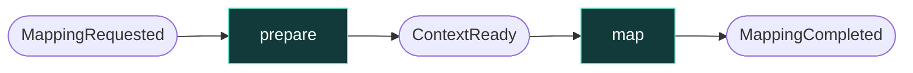
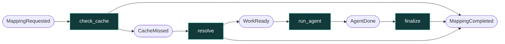

# Catalog Workflows

Generated by `scripts/draw_workflows.py` from the step signatures (`get_workflow_representation`). Boxes are steps, pills are events. Do not edit by hand.

## V1 · `MappingV1`

Two steps and no tools: `prepare` builds the messages and `map` makes one structured call.

## V2 · `MappingV2`

Four steps. `check_cache` and `resolve` can end the run without the model; `run_agent` runs the FunctionAgent below.

## Inside `run_agent` · LlamaIndex `FunctionAgent`

The library's own loop. `submit_listing` is `return_direct`: a valid submission ends the loop in `aggregate_tool_results`; a validation error goes back to the model as a tool result.

```mermaid
flowchart LR
  AgentInput([AgentInput])
  AgentOutput([AgentOutput])
  AgentSetup([AgentSetup])
  AgentWorkflowStartEvent([AgentWorkflowStartEvent])
  StopEvent([StopEvent])
  ToolCall([ToolCall])
  ToolCallResult([ToolCallResult])
  aggregate_tool_results[aggregate_tool_results]
  call_tool[call_tool]
  init_run[init_run]
  parse_agent_output[parse_agent_output]
  run_agent_step[run_agent_step]
  setup_agent[setup_agent]
  AgentInput --> setup_agent
  AgentOutput --> parse_agent_output
  AgentSetup --> run_agent_step
  AgentWorkflowStartEvent --> init_run
  ToolCall --> call_tool
  ToolCallResult --> aggregate_tool_results
  aggregate_tool_results --> AgentInput
  aggregate_tool_results --> StopEvent
  call_tool --> ToolCallResult
  init_run --> AgentInput
  parse_agent_output --> AgentInput
  parse_agent_output --> StopEvent
  parse_agent_output --> ToolCall
  run_agent_step --> AgentOutput
  setup_agent --> AgentSetup
  classDef step fill:#123a3a,stroke:#69e0c5,color:#fff
  class aggregate_tool_results,call_tool,init_run,parse_agent_output,run_agent_step,setup_agent step
```

